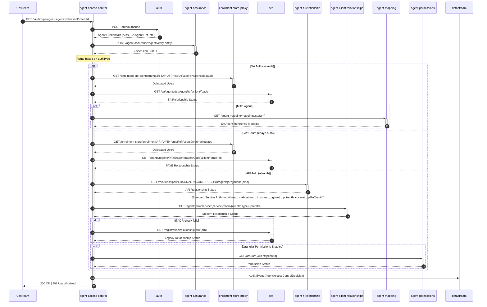

# AAC01: Fetches the current access permissions for a given agent to act on behalf of a client, using the specified authentication type.

## Endpoint
- **Method**: GET
- **Path**: `/{authType}/agent/{agentCode}/client/{clientId}`
- **Audience**: Internal
- **Interaction**: Synchronous

## Description
Fetches the current access permissions for a given agent to act on behalf of a client, using the specified authentication type.

This endpoint validates agent-client relationships and authorization based on the authentication type provided. It performs comprehensive checks including agent authentication, suspension status verification, relationship validation, and optional granular permissions assessment.

### Request Parameters
- **authType**: The authentication type determining the validation path (e.g., `sa-auth`, `epaye-auth`, `afi-auth`, `mtd-it-auth`, `mtd-vat-auth`, `trust-auth`, `cgt-auth`, `ppt-auth`, `cbc-auth`, `pillar2-auth`)
- **agentCode**: The identifier for the agent (format varies by authType: ARN for MTD services, SA Agent Reference for SA, etc.)
- **clientId**: The client's identifier (format varies by service: UTR for SA, NINO for AFI, etc.)

### Supported Authentication Types

| Auth Type | Service | Agent Code Format | Client ID Format | Relationship Store |
|-----------|---------|-------------------|------------------|-------------------|
| `sa-auth` | Self Assessment | SA Agent Reference or ARN | SA UTR | DES + enrolment-store-proxy |
| `epaye-auth` | PAYE | PAYE Agent Code or ARN | Employer Reference | DES + enrolment-store-proxy |
| `afi-auth` | Agent for Individuals | ARN | NINO | agent-fi-relationship |
| `mtd-it-auth` | Making Tax Digital - Income Tax | ARN | MTD IT ID | agent-client-relationships + DES fallback |
| `mtd-vat-auth` | Making Tax Digital - VAT | ARN | VRN | agent-client-relationships + DES fallback |
| `trust-auth` | Trust Registration | ARN | Trust URN or UTR | agent-client-relationships + DES fallback |
| `cgt-auth` | Capital Gains Tax | ARN | CGT Reference | agent-client-relationships + DES fallback |
| `ppt-auth` | Plastic Packaging Tax | ARN | PPT Reference | agent-client-relationships + DES fallback |
| `cbc-auth` | Country-by-Country Reporting | ARN | CBC ID | agent-client-relationships + DES fallback |
| `pillar2-auth` | Pillar 2 | ARN | Pillar 2 ID | agent-client-relationships + DES fallback |

### Response Codes
- **200 OK**: Access is authorized - the agent has valid permissions to act on behalf of the client
- **401 Unauthorized**: Access is denied - agent lacks permissions, is suspended, or relationship doesn't exist

## Processing Flow

### Step 1: Authentication & Authorization
The endpoint first authenticates the requesting agent by calling the auth service (`POST /auth/authorise`). This returns agent credentials including:
- **ARN** (Agent Reference Number) for MTD agents
- **SA Agent Reference** for Self Assessment agents
- Other relevant identifiers based on the authentication type

### Step 2: Suspension Check
A verification call is made to agent-assurance (`POST /agent-assurance/agent/verify-entity`) to check if the agent is currently suspended. Suspended agents are denied access regardless of relationship status.

### Step 3: Relationship Validation (Route-Based)
Based on the `authType` parameter, the endpoint routes to different validation paths:

#### SA Auth (`sa-auth`)
1. Queries enrolment-store-proxy for delegated users with SA enrolment
2. Checks DES for the SA relationship between agent and client
3. If the agent is an MTD agent, retrieves SA Agent Reference mapping from agent-mapping

#### PAYE Auth (`epaye-auth`)
1. Queries enrolment-store-proxy for delegated users with PAYE enrolment
2. Checks DES for the PAYE relationship between agent and client

#### AFI Auth (`afi-auth`)
1. Queries agent-fi-relationship for Personal Income Record relationship status

#### Standard Service Auth (`mtd-it-auth`, `mtd-vat-auth`, `trust-auth`, `cgt-auth`, `ppt-auth`, `cbc-auth`, `pillar2-auth`)
1. Queries agent-client-relationships for modern relationship status
2. If the ACR check fails, falls back to DES for legacy relationship data
3. If granular permissions are enabled, queries agent-permissions for fine-grained access control

### Step 4: Audit & Response
All access decisions are audited via datastream with an `AgentAccessControlDecision` event. The endpoint then returns:
- **200 OK** if all checks pass
- **401 Unauthorized** if any check fails

## Sequence Diagram

## Error Scenarios

The endpoint returns `401 Unauthorized` in the following scenarios:

### Authentication Failures
- **Invalid agent credentials**: The auth service cannot validate the agent's credentials
- **Missing required enrolments**: The agent lacks the necessary enrolments for the requested service
- **Credential mismatch**: The agentCode in the URL doesn't match the authenticated agent's credentials

### Suspension Failures
- **Agent suspended**: agent-assurance indicates the agent is currently suspended
- **Suspension details unavailable**: Unable to verify suspension status

### Relationship Failures
- **No relationship found**: No active relationship exists between the agent and client in any queried system
- **Relationship terminated**: A relationship previously existed but has been terminated
- **Enrolment not delegated**: For SA/PAYE, the enrolment-store-proxy shows no delegation

### Permission Failures (Modern Services Only)
- **Granular permissions denied**: When granular permissions are enabled, agent-permissions indicates insufficient permissions
- **Permission check failure**: Unable to verify granular permissions

### System Failures
- **Downstream unavailable**: Critical dependency (auth, agent-assurance) is unavailable
- **Invalid auth type**: Unsupported authType parameter provided
- **Malformed parameters**: Invalid format for agentCode or clientId

## Access Decision Matrix

| Check Type | Result | Next Action | Final Decision |
|------------|--------|-------------|----------------|
| Auth | Success | Continue to Suspension Check | - |
| Auth | Failure | Skip remaining checks | 401 Unauthorized |
| Suspension | Not Suspended | Continue to Relationship Check | - |
| Suspension | Suspended | Skip remaining checks | 401 Unauthorized |
| Suspension | Check Failed | Skip remaining checks | 401 Unauthorized |
| Relationship (Primary) | Found | Continue to Granular Permissions (if enabled) | - |
| Relationship (Primary) | Not Found | Attempt Fallback (if available) | - |
| Relationship (Fallback) | Found | Continue to Granular Permissions (if enabled) | - |
| Relationship (Fallback) | Not Found | Skip remaining checks | 401 Unauthorized |
| Granular Permissions | Granted | Proceed to Audit | 200 OK |
| Granular Permissions | Denied | Proceed to Audit | 401 Unauthorized |
| Granular Permissions | Not Enabled | Proceed to Audit | 200 OK (if relationship found) |

## Dependencies

### Core Dependencies
- **auth**: Authentication and authorization service
  - Used to validate agent credentials and extract identifiers (ARN, SA Agent Ref, etc.)
  - Endpoint: `POST /auth/authorise`

- **agent-assurance**: Agent verification and suspension management
  - Checks if the agent is currently suspended
  - Endpoint: `POST /agent-assurance/agent/verify-entity`

- **datastream**: Audit logging service
  - Records all access control decisions for compliance and monitoring
  - Event type: `AgentAccessControlDecision`

### Service-Specific Dependencies

#### Legacy Services (SA & PAYE)
- **enrolment-store-proxy**: Enrolment delegation service
  - Retrieves delegated users for IR-SA and IR-PAYE enrolments
  - Endpoints:
    - `GET /enrolment-store/enrolments/IR-SA~UTR~{saUtr}/users?type=delegated`
    - `GET /enrolment-store/enrolments/IR-PAYE~{empRef}/users?type=delegated`

- **des**: Data Exchange Service (legacy relationship store)
  - Validates SA and PAYE relationships
  - Also used as fallback for MTD services if ACR check fails
  - Endpoints:
    - `GET /sa/agents/{saAgentRef}/client/{saUtr}`
    - `GET /agents/regime/PAYE/agent/{agentCode}/client/{empRef}`
    - `GET /registration/relationship/arn/{arn}`

- **agent-mapping**: Agent identifier mapping service
  - Maps MTD ARNs to legacy SA Agent References
  - Endpoint: `GET /agent-mapping/mappings/sa/{arn}`
  - Only used for MTD agents accessing SA services

#### Modern Services (AFI)
- **agent-fi-relationship**: Financial Information relationship store
  - Manages Personal Income Record relationships
  - Endpoint: `GET /relationships/PERSONAL-INCOME-RECORD/agent/{arn}/client/{nino}`

#### Modern Services (MTD & Others)
- **agent-client-relationships**: Primary relationship store for modern services
  - Handles relationships for MTD-IT, MTD-VAT, Trust, CGT, PPT, CBC, and Pillar2
  - Endpoint: `GET /agent/{arn}/service/{service}/client/{clientIdType}/{clientId}`

- **agent-permissions** (optional): Granular permissions service
  - Provides fine-grained access control when enabled
  - Endpoint: `GET /arn/{arn}/client/{clientId}`
  - Only invoked for modern services when granular permissions feature is enabled

## Configuration & Implementation Notes

### Caching Considerations
- Authentication results may be cached by the auth service
- Suspension status is not cached to ensure real-time enforcement
- Relationship status caching depends on the backing service (DES, ACR, AFI-R)

### Performance Characteristics
- **Best case latency**: ~200-300ms (auth + suspension + single relationship check)
- **Worst case latency**: ~800-1200ms (auth + suspension + failed primary + successful fallback + granular permissions)
- **Typical latency**: ~400-600ms

### Service Path Selection Logic
The endpoint uses the following logic to determine which services to query:

1. **Legacy Services (SA, PAYE)**: Always query enrolment-store-proxy + DES
2. **AFI Service**: Directly query agent-fi-relationship (no fallback)
3. **Modern MTD Services**: Query agent-client-relationships, fallback to DES if needed
4. **Granular Permissions**: Only for modern MTD services when feature flag is enabled

### Fallback Behavior
- **SA/PAYE**: No fallback available - both enrolment-store-proxy and DES must succeed
- **AFI**: No fallback available - agent-fi-relationship is authoritative
- **Modern MTD Services**: DES serves as fallback if agent-client-relationships doesn't find a relationship
- **Granular Permissions**: Feature flag controlled, fails closed (denies access) if enabled but unavailable

### Audit Trail
Every access decision is recorded in datastream with the following information:
- Request timestamp
- Agent identifier (ARN/SA Agent Ref/PAYE Agent Code)
- Client identifier
- Authentication type
- Access decision (granted/denied)
- Reason for denial (if applicable)
- Suspension status
- Relationship sources consulted
- Granular permissions result (if applicable)

### Monitoring & Observability
Key metrics to monitor:
- Request volume by authType
- Success/failure rates per authType
- Latency percentiles (p50, p95, p99)
- Downstream service availability impact
- Suspension denial rate
- Granular permissions denial rate (when enabled)
- Fallback invocation rate for MTD services

### Security Considerations
- All requests must include valid authentication headers
- Agent credentials are validated before any authorization checks
- Suspended agents are denied immediately, regardless of relationship status
- Granular permissions provide an additional layer of fine-grained control
- All access decisions are audited for compliance and forensic analysis
- No caching of denial decisions to ensure immediate enforcement of suspensions
