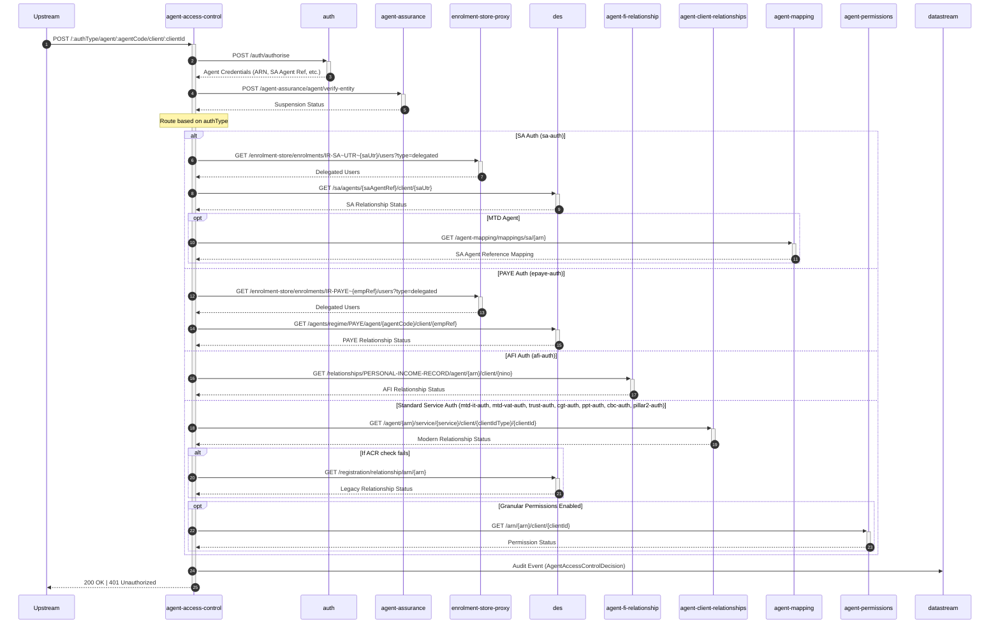

# AAC02: Establishes or modifies the access permissions for a given agent to represent a client, based on the provided authentication type.

## Endpoint
- **Method**: POST
- **Path**: `/{authType}/agent/{agentCode}/client/{clientId}`
- **Audience**: Internal
- **Interaction**: Synchronous

## Description
Establishes or modifies the access permissions for a given agent to represent a client, based on the provided authentication type.

This endpoint creates or updates agent-client relationships across multiple backend systems. Unlike the GET endpoint (AAC01) which only queries existing relationships, this POST endpoint performs write operations to establish relationships. It validates agent authentication, checks suspension status, and then creates or updates the relationship in the appropriate backend store based on the authentication type.

### Request Parameters
- **authType**: The authentication type determining the validation and creation path (e.g., `sa-auth`, `epaye-auth`, `afi-auth`, `mtd-it-auth`, `mtd-vat-auth`, `trust-auth`, `cgt-auth`, `ppt-auth`, `cbc-auth`, `pillar2-auth`)
- **agentCode**: The identifier for the agent (format varies by authType: ARN for MTD services, SA Agent Reference for SA, PAYE Agent Code for PAYE)
- **clientId**: The client's identifier (format varies by service: UTR for SA, NINO for AFI, VRN for VAT, etc.)

### Supported Authentication Types

| Auth Type | Service | Agent Code Format | Client ID Format | Relationship Store |
|-----------|---------|-------------------|------------------|-------------------|
| `sa-auth` | Self Assessment | SA Agent Reference or ARN | SA UTR | DES + enrolment-store-proxy |
| `epaye-auth` | PAYE | PAYE Agent Code or ARN | Employer Reference | DES + enrolment-store-proxy |
| `afi-auth` | Agent for Individuals | ARN | NINO | agent-fi-relationship |
| `mtd-it-auth` | Making Tax Digital - Income Tax | ARN | MTD IT ID | agent-client-relationships + DES fallback |
| `mtd-vat-auth` | Making Tax Digital - VAT | ARN | VRN | agent-client-relationships + DES fallback |
| `trust-auth` | Trust Registration | ARN | Trust URN or UTR | agent-client-relationships + DES fallback |
| `cgt-auth` | Capital Gains Tax | ARN | CGT Reference | agent-client-relationships + DES fallback |
| `ppt-auth` | Plastic Packaging Tax | ARN | PPT Reference | agent-client-relationships + DES fallback |
| `cbc-auth` | Country-by-Country Reporting | ARN | CBC ID | agent-client-relationships + DES fallback |
| `pillar2-auth` | Pillar 2 | ARN | Pillar 2 ID | agent-client-relationships + DES fallback |

### Response Codes
- **200 OK**: Relationship successfully created or updated
- **201 Created**: New relationship successfully established
- **401 Unauthorized**: Creation failed - agent authentication failed, agent is suspended, or authorization is missing
- **403 Forbidden**: Agent does not have permission to create this relationship
- **409 Conflict**: Relationship already exists or conflicts with existing data

## Processing Flow

### Step 1: Authentication & Authorization
The endpoint first authenticates the requesting agent by calling the auth service (`POST /auth/authorise`). This validates the agent's credentials and returns:
- **ARN** (Agent Reference Number) for MTD agents
- **SA Agent Reference** for Self Assessment agents
- **PAYE Agent Code** for PAYE agents
- Other relevant identifiers based on the authentication type

### Step 2: Suspension Check
A verification call is made to agent-assurance (`POST /agent-assurance/agent/verify-entity`) to ensure the agent is not currently suspended. Suspended agents cannot create or modify relationships.

### Step 3: Relationship Creation/Modification (Route-Based)
Based on the `authType` parameter, the endpoint routes to different creation paths:

#### SA Auth (`sa-auth`)
1. Queries enrolment-store-proxy to verify existing SA delegated enrolments
2. Creates or updates the SA relationship in DES (`GET /sa/agents/{saAgentRef}/client/{saUtr}`)
3. For MTD agents, ensures proper mapping exists in agent-mapping service

**Write Operation**: Creates SA agent-client relationship in DES

#### PAYE Auth (`epaye-auth`)
1. Queries enrolment-store-proxy to verify existing PAYE delegated enrolments
2. Creates or updates the PAYE relationship in DES (`GET /agents/regime/PAYE/agent/{agentCode}/client/{empRef}`)

**Write Operation**: Creates PAYE agent-client relationship in DES

#### AFI Auth (`afi-auth`)
1. Creates or updates the Personal Income Record relationship in agent-fi-relationship service
2. Validates the NINO exists and is valid

**Write Operation**: Creates AFI relationship in agent-fi-relationship

#### Standard Service Auth (`mtd-it-auth`, `mtd-vat-auth`, `trust-auth`, `cgt-auth`, `ppt-auth`, `cbc-auth`, `pillar2-auth`)
1. Creates or updates the relationship in agent-client-relationships (primary modern store)
2. If ACR creation fails or for legacy agents, falls back to creating in DES
3. If granular permissions are enabled, also creates permission entries in agent-permissions

**Write Operations**: 
- Creates relationship in agent-client-relationships
- Optionally creates fallback in DES
- Optionally creates granular permissions in agent-permissions

### Step 4: Audit & Response
All relationship creation/modification decisions are audited via datastream with an `AgentAccessControlDecision` event including:
- Timestamp of the operation
- Agent and client identifiers
- Authentication type used
- Success or failure status
- Backend systems updated
- Any validation failures

The endpoint then returns appropriate HTTP status code based on the operation result.

## Sequence Diagram

## Dependencies

### Core Services (Mandatory)
- **auth**: Authentication and authorization service
  - Endpoint: `POST /auth/authorise`
  - Purpose: Validates agent credentials and returns agent identifiers
  
- **agent-assurance**: Agent verification and suspension management
  - Endpoint: `POST /agent-assurance/agent/verify-entity`
  - Purpose: Ensures agent is not suspended before allowing relationship creation
  
- **datastream**: Audit logging service
  - Purpose: Records all relationship creation/modification attempts for compliance

### Legacy Services (Conditional)
- **enrolment-store-proxy**: Enrolment delegation service
  - Endpoints:
    - `GET /enrolment-store/enrolments/IR-SA~UTR~{saUtr}/users?type=delegated`
    - `GET /enrolment-store/enrolments/IR-PAYE~{empRef}/users?type=delegated`
  - Purpose: Validates existing delegated enrolments for SA and PAYE
  - Used for: `sa-auth`, `epaye-auth`

- **des** (Data Exchange Service): Legacy relationship store
  - Endpoints:
    - `GET /sa/agents/{saAgentRef}/client/{saUtr}` - SA relationships
    - `GET /agents/regime/PAYE/agent/{agentCode}/client/{empRef}` - PAYE relationships
    - `GET /registration/relationship/arn/{arn}` - Fallback relationship check
  - Purpose: Primary store for legacy SA/PAYE relationships, fallback for MTD services
  - Used for: `sa-auth`, `epaye-auth`, fallback for modern services

- **agent-mapping**: ARN to legacy reference mapping service
  - Endpoint: `GET /agent-mapping/mappings/sa/{arn}`
  - Purpose: Maps MTD ARNs to legacy SA Agent References
  - Used for: `sa-auth` (MTD agents only)

### Modern Services (Conditional)
- **agent-fi-relationship**: Financial information relationship store
  - Endpoint: `GET /relationships/PERSONAL-INCOME-RECORD/agent/{arn}/client/{nino}`
  - Purpose: Manages AFI relationships for personal income records
  - Used for: `afi-auth`

- **agent-client-relationships**: Primary modern relationship store
  - Endpoint: `GET /agent/{arn}/service/{service}/client/{clientIdType}/{clientId}`
  - Purpose: Primary store for all modern MTD service relationships
  - Used for: `mtd-it-auth`, `mtd-vat-auth`, `trust-auth`, `cgt-auth`, `ppt-auth`, `cbc-auth`, `pillar2-auth`

- **agent-permissions**: Granular permissions service
  - Endpoint: `GET /arn/{arn}/client/{clientId}`
  - Purpose: Fine-grained access control for specific tax obligations
  - Used for: Modern MTD services (when feature flag enabled)

## Notes
- This endpoint performs **write operations** to establish relationships, unlike AAC01 which only reads
- Multiple backend stores may be updated depending on the authentication type
- Legacy and modern relationship stores are queried/updated based on the service type
- The endpoint includes comprehensive validation before creating relationships
- All operations are fully audited for compliance and troubleshooting
- Idempotent behavior: repeated calls with same parameters should not create duplicate relationships
