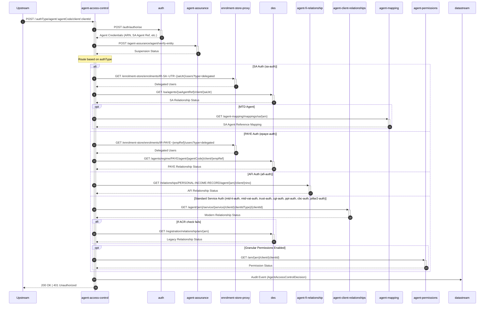

# agent-access-control

## AuthorisationController

---

## GET /:authType/agent/:agentCode/client/:clientId

**Description:** Authorises an agent for a client based on the specified auth type. Supports multiple tax regimes including SA, PAYE, MTD-IT, MTD-VAT, Trust, CGT, PPT, CBC, and Pillar2.

### Sequence of Interactions

1. **API Call:** Authenticates the agent via `POST /auth/authorise` to the `auth` service and retrieves their credentials (ARN, SA Agent Reference, etc.).
2. **API Call:** Checks if the agent is suspended via `POST /agent-assurance/agent/verify-entity` to the `agent-assurance` service.
3. **API Call:** For SA/PAYE auth types, checks delegated users via `GET /enrolment-store/enrolments/{enrolmentKey}/users` to `enrolment-store-proxy`.
4. **API Call:** For SA auth, checks legacy SA relationship via `GET /sa/agents/{saAgentRef}/client/{saUtr}` to `des`.
5. **API Call:** For PAYE auth, checks legacy PAYE relationship via `GET /agents/regime/PAYE/agent/{agentCode}/client/{empRef}` to `des`.
6. **API Call:** For AFI auth, checks relationship via `GET /relationships/PERSONAL-INCOME-RECORD/agent/{arn}/client/{nino}` to `agent-fi-relationship`.
7. **API Call:** For standard services, checks modern relationships via `GET /agent/{arn}/service/{service}/client/{clientIdType}/{clientId}` to `agent-client-relationships`.
8. **API Call:** For standard services, falls back to DES via `GET /registration/relationship/arn/{arn}` if ACR check fails.
9. **API Call:** For SA with MTD agents, gets SA agent reference mapping via `GET /agent-mapping/mappings/sa/{arn}` to `agent-mapping`.
10. **API Call:** For standard services with granular permissions enabled, checks permissions via `GET /arn/{arn}/client/{clientId}` to `agent-permissions`.
11. **Audit Event:** Audits the access control decision with details of the outcome to `datastream`.

### Sequence Diagram

---

## POST /:authType/agent/:agentCode/client/:clientId

**Description:** Authorises an agent for a client based on the specified auth type. Identical functionality to GET endpoint but uses POST method. Supports multiple tax regimes including SA, PAYE, MTD-IT, MTD-VAT, Trust, CGT, PPT, CBC, and Pillar2.

### Sequence of Interactions

1. **API Call:** Authenticates the agent via `POST /auth/authorise` to the `auth` service and retrieves their credentials (ARN, SA Agent Reference, etc.).
2. **API Call:** Checks if the agent is suspended via `POST /agent-assurance/agent/verify-entity` to the `agent-assurance` service.
3. **API Call:** For SA/PAYE auth types, checks delegated users via `GET /enrolment-store/enrolments/{enrolmentKey}/users` to `enrolment-store-proxy`.
4. **API Call:** For SA auth, checks legacy SA relationship via `GET /sa/agents/{saAgentRef}/client/{saUtr}` to `des`.
5. **API Call:** For PAYE auth, checks legacy PAYE relationship via `GET /agents/regime/PAYE/agent/{agentCode}/client/{empRef}` to `des`.
6. **API Call:** For AFI auth, checks relationship via `GET /relationships/PERSONAL-INCOME-RECORD/agent/{arn}/client/{nino}` to `agent-fi-relationship`.
7. **API Call:** For standard services, checks modern relationships via `GET /agent/{arn}/service/{service}/client/{clientIdType}/{clientId}` to `agent-client-relationships`.
8. **API Call:** For standard services, falls back to DES via `GET /registration/relationship/arn/{arn}` if ACR check fails.
9. **API Call:** For SA with MTD agents, gets SA agent reference mapping via `GET /agent-mapping/mappings/sa/{arn}` to `agent-mapping`.
10. **API Call:** For standard services with granular permissions enabled, checks permissions via `GET /arn/{arn}/client/{clientId}` to `agent-permissions`.
11. **Audit Event:** Audits the access control decision with details of the outcome to `datastream`.

### Sequence Diagram

